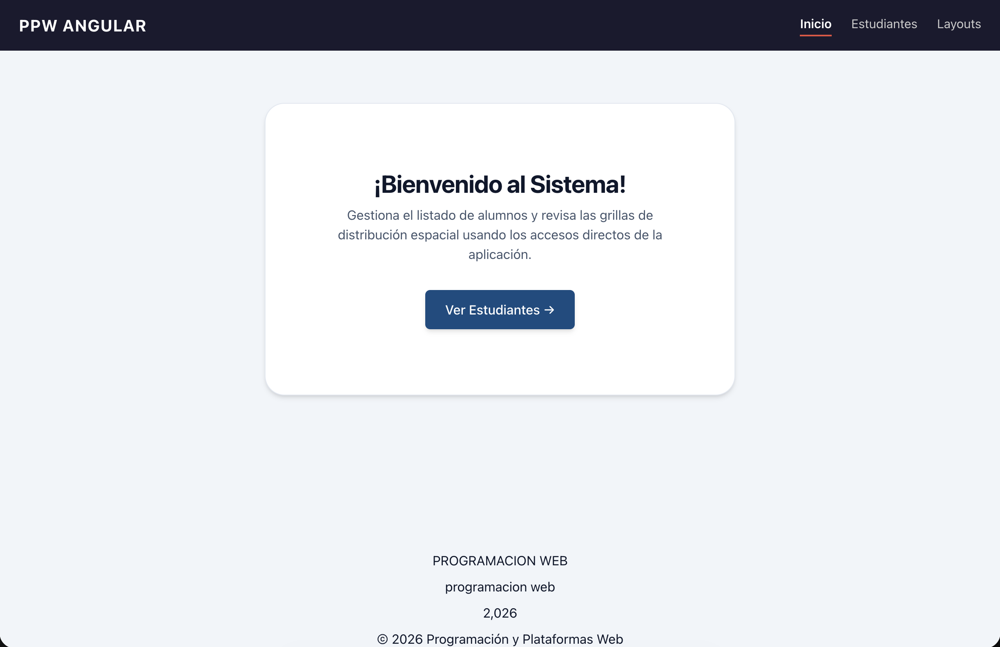
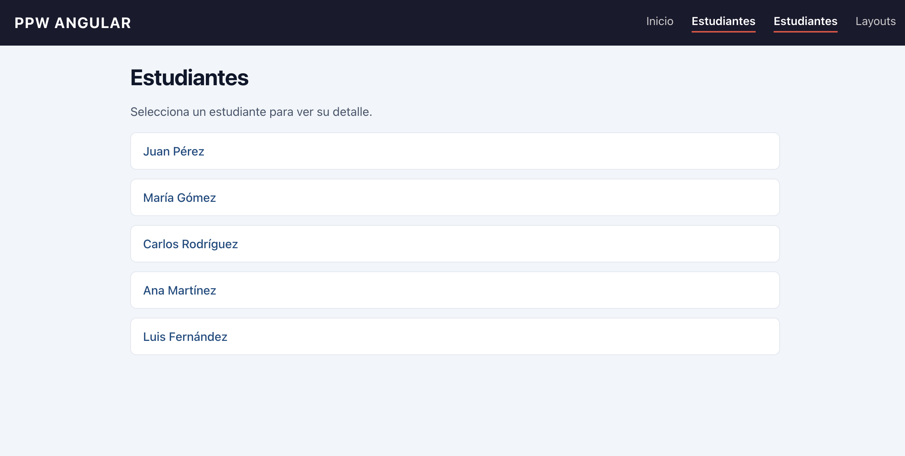
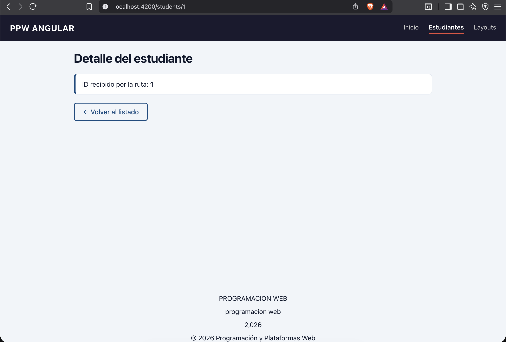
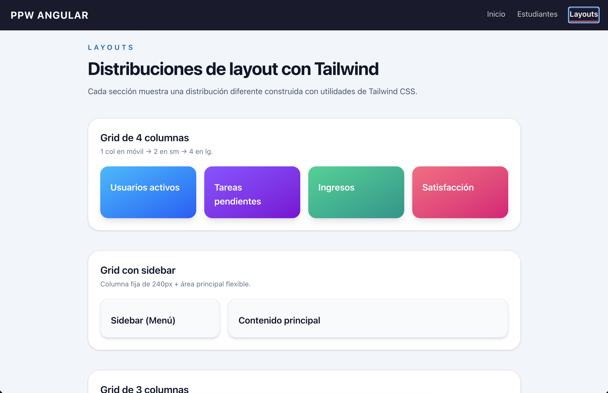
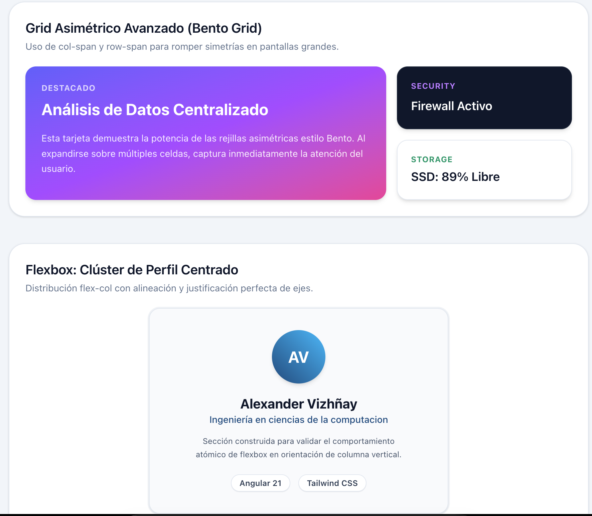

# Proyecto Incremental - Frameworks Web: Angular 21 + TailwindCSS
## Materia: Programación y Plataformas Web (PPW)

**Estudiante:** Alexander Vizhñay  
**Institución:** Universidad Politécnica Salesiana  
**Carrera:** Ingeniería en Ciencias de la Computación  
**Workstation:** MacBook Pro M4  

---

## 🚀 Descripción del Proyecto
Este repositorio contiene el avance incremental de los laboratorios prácticos de Angular 21. La aplicación ha migrado de una arquitectura estática local hacia una **Single Page Application (SPA)** completamente navegable, reactiva mediante el uso de **Signals**, y estilizada de manera responsiva utilizando las utilidades nativas de **Tailwind CSS v4** junto con el sistema de componentes semánticos de **DaisyUI**.

El proyecto sigue una estructura limpia orientada a componentes *standalone* organizados por carpetas de *features* de negocio y elementos UI puros.

---

## 🛠️ Resumen Técnico de Prácticas Implementadas

### Modulo 02: Fundamentos de Angular
* Creación e integración de componentes standalone reutilizables (`AppHeaderComponent` y `AppHeroComponent`).
* Implementación del sistema reactivo moderno de Angular mediante **Signals** (`signal`, `computed`) para gestionar dinámicamente el estado del título y la visibilidad de bloques informativos.
* Uso de directivas de control de flujo declarativas nativas (`@if`, `@for` con `track`, y `@switch`).

### Modulo 03: Navegación y Rutas (SPA)
* Configuración del enrutamiento global en `app.routes.ts` con soporte para segmentos fijos, comodines de fallback (`**`) y parámetros dinámicos.
* Implementación de carga diferida (Lazy Loading) utilizando `loadComponent` para optimizar el rendimiento.
* Lectura e interpretación de parámetros dinámicos de URL usando `ActivatedRoute` y su propiedad `snapshot.paramMap.get('id')`.
* Estilización de enlaces activos en el navbar superior mediante la directiva `routerLinkActive`.

### Modulo 04: Estilos y Layout con Tailwind CSS
* Configuración de Tailwind CSS v4 mediante PostCSS (`.postcssrc.json`) y personalización del tema de marca (`--color-brand`) en `src/styles.css`.
* Eliminación completa de hojas de estilos CSS tradicionales dispersas (`.css` vacíos) y sustitución por clases de utilidad combinables directamente en las plantillas HTML.
* Creación de la página `LayoutsPage` para explorar distribuciones avanzadas espaciales de Grid y Flexbox.

### Modulo 06: Temas y Componentes UI (DaisyUI)
* Integración del plugin **DaisyUI** como capa semántica sobre TailwindCSS para acelerar el desarrollo.
* Aplicación de un tema global estructurado (`data-theme="cupcake"`) para estandarizar la jerarquía visual de colores.
* Refactorización del Shell de navegación (`AppHeader`) implementando un menú responsivo colapsable para móviles y submenús interactivos.
* Construcción de un **Mini Design System** aislado de la lógica de negocio, compuesto por tarjetas de cristal (`glass-stat-card`), banners con gradientes (`gradient-cta-banner`) y listas de etiquetas (`feature-chip-list`) utilizando la API moderna de `input()` de Angular.

---

## 📸 Evidencias Visuales del Sistema (Capturas de Pantalla)

> **Nota para la calificación:** Para visualizar correctamente las imágenes en este documento, guarde sus capturas en formato `.png` dentro de una carpeta llamada `capturas` en la raíz del proyecto, nombrándolas exactamente como se indica en cada apartado.

### 1. Pantalla de Inicio (HomePage)
Muestra el componente Hero unificado, el contenedor centrado responsivo y los dos botones de acción configurados en paralelo (un botón con estilos CSS heredados y otro nativo de Tailwind).
* **Nombre de archivo requerido:** `capturas/01-home-page.png`
* **Evidencia visual:**
    

### 2. Listado General de Estudiantes (StudentsPage)
Muestra la lista reactiva de estudiantes renderizada mediante `@for` a partir de un `signal()`. Cada celda está encapsulada en una tarjeta interactiva blanca con bordes definidos y efecto hover utilizando Tailwind CSS.
* **Nombre de archivo requerido:** `capturas/02-students-list.png`
* **Evidencia visual:**
    

### 3. Detalle Dinámico de Estudiante (StudentDetailPage)
Demuestra la captura exitosa del parámetro `:id` desde la URL a través de `ActivatedRoute`. Diseñado usando un contenedor con acento izquierdo sólido de color de marca (`border-l-4 border-l-brand`) y un botón outline interactivo de retorno.
* **Nombre de archivo requerido:** `capturas/03-student-detail.png`
* **Evidencia visual:**
    

### 4. Muestrario Completo de Layouts Base (Grid y Flexbox)
Sección superior de la página `LayoutsPage`. Muestra las distribuciones estándar solicitadas en la práctica: Grid de 4 columnas con degradados de color, Grid administrativo con Sidebar lateral fijo, Grid de 3 columnas puras, y el Carrusel Flexbox con scroll horizontal adaptado a dispositivos móviles.
* **Nombre de archivo requerido:** `capturas/04-layouts-base.png`
* **Evidencia visual:**
    

### 5. Layouts Adicionales Implementados (Práctica Avanzada)
Demuestra la resolución de la sección práctica autónoma mediante el diseño de dos composiciones adicionales avanzadas tomadas de la documentación oficial de Tailwind CSS:
1.  **Grid Asimétrico Avanzado (Bento Grid):** Combinación de utilidades `md:col-span-2` y `md:row-span-2` para romper la simetría visual.
2.  **Flexbox Clúster Centrado:** Tarjeta de perfil tipográfica perfectamente equilibrada en sus ejes de gravedad horizontal y vertical con anillos de microborde (`ring-2`).
* **Nombre de archivo requerido:** `capturas/05-layouts-avanzados.png`
* **Evidencia visual:**
    

### 6. Catálogo de Componentes UI (DaisyUI Base)
Despliegue del Design System implementando la distribución asimétrica y la inyección de datos a componentes visuales puros usando `input()`.
* **Nombre de archivo requerido:** `capturas/06-ui-components-base.png`
* **Evidencia visual:**
    

### 7. Componentes UI Adicionales (Práctica Autónoma DaisyUI)
Evidencia de la implementación de 5 componentes visuales extra (Avatar, Accordion, Steps, Alert, Stat) diseñados e integrados de forma independiente.
* **Nombre de archivo requerido:** `capturas/07-ui-components-extra.png`
* **Evidencia visual:**
    

---

## 📐 Detalles Técnicos de Layouts y Componentes UI

| Elemento / Distribución | Clases Principales / Implementación | Propósito del Diseño |
| :--- | :--- | :--- |
| **Grid 4 Columnas** | `grid gap-4 sm:grid-cols-2 lg:grid-cols-4` | Rejilla fluida y responsiva que muta de 1 a 4 columnas con elevación de sombra (`shadow-lg`). |
| **Grid con Sidebar** | `grid gap-4 lg:grid-cols-[240px_minmax(0,1fr)]` | Layout clásico de Panel de Control con barra lateral rígida y sección de contenido elástica. |
| **Bento Grid** | `md:col-span-2 md:row-span-2` | Arquitectura asimétrica avanzada para jerarquizar información mediante celdas expandidas. |
| **Header Navbar** | `navbar collapse lg:flex` | Patrón de navegación híbrida que muta a un menú de hamburguesa en pantallas móviles. |
| **Glass Card** | `bg-white/10 backdrop-blur-xl border-white/20` | Superficie translúcida moderna que no rompe la estructura del fondo. |
| **Gradient Banner** | `bg-gradient-to-br from-sky-500 to-indigo-500` | Superficie de alto valor visual para destacar los Call to Action (CTA). |

---

## ⚙️ Instrucciones de Despliegue Local

Para levantar este proyecto en su entorno local, asegúrese de contar con Node.js y el gestor de paquetes `pnpm` instalado. Ejecute las siguientes líneas en su terminal:

```bash
# 1. Instalar de manera limpia todas las dependencias del package.json
pnpm install

# 2. Compilar el bundle de desarrollo y abrir la aplicación automáticamente en el navegador
ng serve -o
